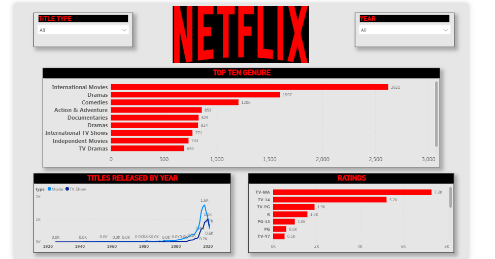

# 🎬 Netflix Content Trends Analysis Dashboard

## 📌 Project Overview

This project presents an interactive Power BI dashboard that analyzes Netflix's content library. The dashboard provides insights into content distribution, genres, ratings, release years, countries, and content types through interactive visualizations and business intelligence techniques.

---

## 🎯 Project Objectives

- Analyze Movies vs TV Shows
- Explore content distribution by country
- Identify popular genres
- Analyze release year trends
- Examine content ratings
- Build an interactive dashboard for business insights

---

## 🛠️ Tools & Technologies

- Power BI
- Power Query
- DAX
- Microsoft Excel

---

## 📊 Dashboard Preview



---

## 📂 Dataset

This project uses the publicly available Netflix Titles dataset.

Files included:

- netflix_titles.csv

---

## 📈 Key Insights

- Compared Movies and TV Shows distribution.
- Analyzed genre-wise content availability.
- Explored country-wise content production.
- Visualized yearly content release trends.
- Examined content ratings across categories.

---

## 💼 Skills Demonstrated

- Data Cleaning
- Data Transformation
- Power Query
- DAX
- Data Visualization
- Dashboard Development
- Business Intelligence
- KPI Reporting

---

## 📁 Repository Structure

```
Netflix-Content-Trends-Analysis/
│
├── NETFLIX.pbix
├── README.md
├── Data/
└── Images/
```
